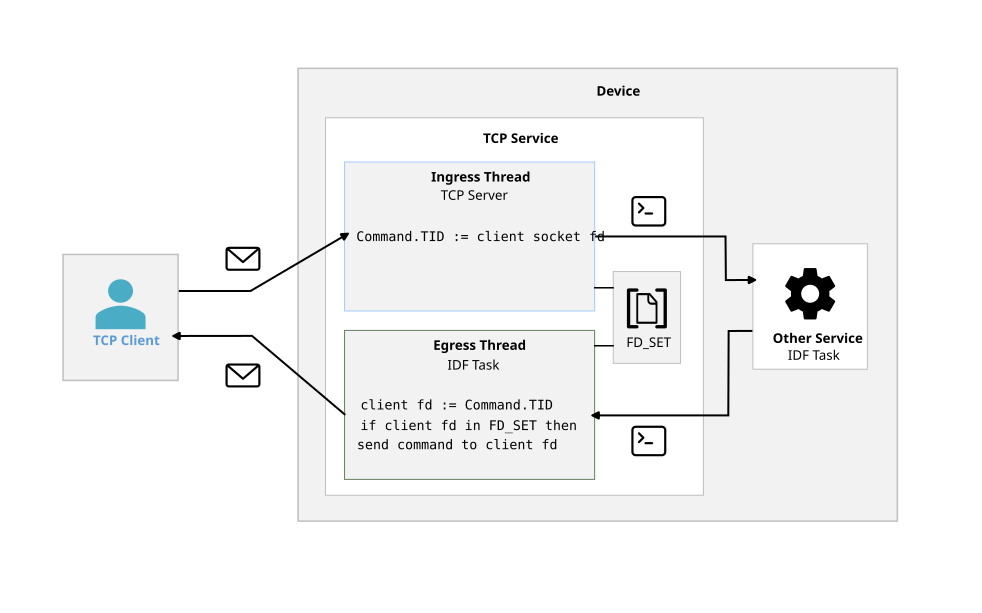
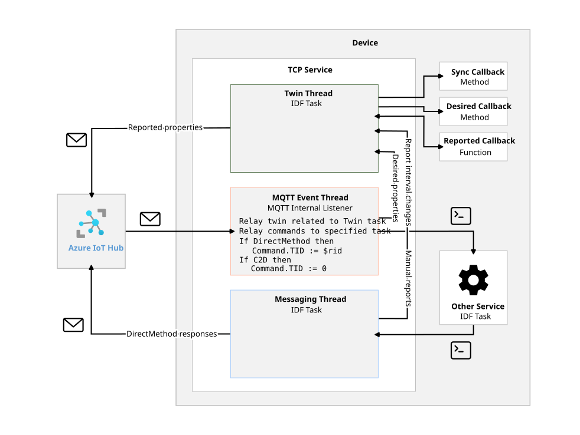

# BarnaNetLibrary

## TODO
- [x] Alarms
- [x] Test sunrise
- [x] Azure IoT HUB integration
	- The MQTT client only works with Azure at the moment
- [ ] Clean up
	- [ ] In all helper function, do check whether the pointer is NULL !!
	- [ ] Check the command structure's lifetime against using them after their original scope is already over
- [ ] Test TCP and MQTT connections against brute force attacks
- [x] Send the alarm count in the list alarms response
- [x] Add transmission ID to the command structure
	- TCP server would assign a transmission ID to each request and would map these IDs to client sockets
	- Azure MQTT broker already gives an ID to the Direct Methods (when it is zero, the reply could immediately be discarded)
	- The system cannot have multiple commands processing at the same time, since the whole server halts until the task replies
	- The TCP server will need a new task for the queue (ingress and egress task?)
- [ ] Test flashing from Github Codespace using port forwarding
- [ ] Azure Device Twin
	- [ ] Expose a function to the parent project to update the twin
	- [ ] Best use would be to store the project name, so the web app wouldn't need to query it every time to display the different UI per project
- [ ] Test [QEMU emulation](https://docs.espressif.com/projects/esp-idf/en/latest/esp32/api-guides/tools/qemu.html)
- [ ] Add OTA update functionality
- [ ] Home Assistant integration
- [x] Add two functions for sending commands, one for the comms tasks and one for responding to it
- [x] Add a new flag for only responses to avoid comms tasks sending commands to each other
- [x] NVS: https://docs.espressif.com/projects/esp-idf/en/stable/esp32/api-reference/storage/nvs_flash.html#application-example
- [ ] mDNS or a custom discovery protocol to see other BarnaNet devices
- [ ] Manual connect to WIFI using the device as an AP and a web interface
- [ ] Performance: https://docs.espressif.com/projects/esp-idf/en/stable/esp32/api-guides/performance/speed.html

## New Devices
- When purchasing new devices, please note that few are going EOL
- https://www.espressif.com/en/products/longevity-commitment
- https://documentation.espressif.com/esp32_datasheet_en.pdf
- DEV0: `ESP32-D0WDQ6-V3` is already EOL

## Project structure
- Some systems are implemented using FreeRTOS tasks
- Each task is implemented as an infinite loop running in parallel
- Every system task should have an ID (max 8bit) for communication (**This cannot be zero**)
- Task communication
	- The `B_addressMap_t` structure stores the `B_address_t` structures
	- These addresses are key-value pairs (and flags) to match the TaskID to its queue handle
	- The address map can be initialized with the `B_AddressMapInit` function and deleted with the `B_AddressmapCleanup`
	- To insert a task, use the `B_InsertAddress`
	- Available flags are:
		- `B_TASK_FLAG_NO_REPLY`: The task wishes to not receive replies
		- `B_TASK_FLAG_ONLY_REPLY`: The task wishes to only receive replies
		- These flags are enforced by the internal command routing functions (see below)
	- To find the queue handle with an ID, use `B_GetAddress` or `B_GetAddressAndFlags`

## BarnaNet Protocol
- For the definition, see [B_BarnaNetCommand.h](/B_BarnaNetCommand.h)
- For the API endpoints, see [Protocol.md](/Protocol.md)
- The protocol lies on a command structure that is used to communicate to the board and inside the board between tasks
- The command structure is aligned to one byte; this allows it to be copied to straight from the TCP receive buffer
- A command has 5 identifiers:
	- Origin (FROM): specifies which system the command is coming from
	- Destination (DEST): specifies which subsystem the command is heading to
	- Operation (OP): defines the type of the command, can be SET, GET, RESPONSE or ERROR
	- ID: uniquely defines a function for the task
	- Transmission ID: Couples requests and responses to allow multiple commands to be processed at the same time
- The structure
	- The size is defined as B_COMMAND_STRUCT_SIZE
	- FROM: 1 byte
	- DEST: 1 byte
	- Header: 1 byte; Contains the OP and the ID
	- Body size is B_COMMAND_BODY_SIZE (or B_COMMAND_STRUCT_SIZE - 3)
- There are helper function to help with filling or reading the command struct
	- Filling the body: `B_FillCommandBodyString`, `B_FillCommandBody_BYTE`, `B_FillCommandBody_WORD`, `B_FillCommandBody_DWORD`
	- Reading the body: `B_ReadCommandBody_BYTE`, `B_ReadCommandBody_WORD`, `B_ReadCommandBody_DWORD`
- Helper functions for sending commands internally
	- `B_SendStatusReply`: sends a simple status reply string (RES or ERR)
	- `B_SendReplyCommand`: after filling a command's body, this function populates the header and sends it to the destination task
	- `B_RelayCommand`: used by comms tasks, relays a command to another task

## API
- The library contains helper classes and functions to build and parse commands
	- The `Command` class represents a BarnaNet command structure
		- It has helper functions to get and set the header fields and to get and set the body bytes
		- It can convert itself to and from bytes

	- The `Connection` class is a TCP client

	- The `Service` class is a super-class for all services (tasks)
		- Each service should implement static methods to build and parse commands
		- The function naming convention is `Build_<OP>_<CommandName>` and `Parse_<OP>_<request OP>_<CommandName>` (Both GET and SET can have individual response and error parsers)
		- The `Build_` functions should return a `Command` object
			- These can throw error, as the explorer will catch them and display the error message
		- The `Parse_RES_` or `Parse_ERR_` functions should return a string representation of the command

- The alarm API is implemented in the [AlarmService](/api/AlarmService.py) file

- Additionally, it includes a simple GUI explorer to test the API endpoints
	- The explorer is built using the [Textual](https://textual.textualize.io/) library
	- See usage example in the [api/test/libraryExplorer.py](api/test/libraryExplorer.py) file
		- The app takes a list of classes as arguments, that inherit from the `Service` class. It will display the defined build commands in tabs to allow easy testing.
		- If the the build functions have python style docstrings, the explorer GUI will display them
		- It also takes an IP and a port to connect to the device. This way, the generated commands can be sent to the device and the responses are displayed in the GUI as well.

## WIFI
For definition, see [B_wifi.h](/B_wifi.h)
- Simple station WIFI driver
- Credentials could be stored in the sdkconfig as well, but this way they are not committed to the repository
- To connect, call the `B_WifiConnect` function

## TIME
For definition, see [B_time.h](/B_time.h)
- [ESP-IDF time documentation](https://docs.espressif.com/projects/esp-idf/en/stable/esp32/api-reference/system/system_time.html)
- Defines a 32bit type `B_timepart_t` that holds the hours, minutes and seconds of a timestamp
- Includes an SNTP client to sync the system time
	- `B_SyncTime` should be called in the main task after connected to WIFI
	- The timezone and the SNTP server are defined here as well
	- Getting the system time can be done using regular C functions
- Includes Sunrise and Sunset calculation function
	- To ease the strain, two prebaked tables are also defined
	- To get the data, I used the [NOAA calculator](https://gml.noaa.gov/grad/solcalc/), exported the [table](https://gml.noaa.gov/grad/solcalc/table.php?lat=47.896076&lon=20.380324&year=2025), removed DST in excel and parsed it
	- Or use the [python script](/utils/bakeSun.py) to cook up the table

## COLOR
For definition, see [B_colorUtil.h](/B_colorUtil.h)
- Defines an RGB structure and several color manipulation functions

## WS2812
For definition, see [B_WS2812.h](/B_WS2812.h)
- [RMT LED example](https://github.com/espressif/esp-idf/tree/f404fe96b17692e3f1de536a3d73a180cdb53b42/examples/peripherals/rmt/led_strip/main)
- [ESP-IDF RMT documentation](https://docs.espressif.com/projects/esp-idf/en/stable/esp32/api-reference/peripherals/rmt.html)
- [WS2812B datasheet](https://cdn-shop.adafruit.com/datasheets/WS2812B.pdf)
- [WS2812 datasheet](https://cdn-shop.adafruit.com/datasheets/WS2812.pdf)
- Uses the RMT peripheral to generate the precise timing required by the WS2812B LEDs
- The WS2812B LEDs expect color data in GRB format
- The RMT channel is set up using the `B_WS2812_SetUpRMTChannel` function
- The `B_WS2812_Transmit` function sends the color data to the LEDs
- The RMT channel and encoders can be cleaned up using the `B_WS2812_CleanupRMT` function

## TCP Server
For definition, see [B_tcpServer.h](/B_tcpServer.h)
- Task function: `B_TCPIngressTask`
- For the task parameter, the given `B_TCPIngressTaskParameter` struct should be filled
- Receives and forwards commands to the appropriate task
- Another task, `B_TCPEgressTask` is responsible for listening on the queue and sending the responses back to the clients
- The task uses the socket id as the transmission ID for the command
	- It can do it as long as the number of available sockets (FD_SETSIZE) is less than 256
- The task should be run with at least 4096 words of stack depth (a word is the width of the stack portSTACK_TYPE)
- The server can handle multiple clients in parallel thanks to the separation of ingress and egress tasks
- The server binds to all interfaces on the port specified in the menuconfig
- The server doesn't currently bind to IPv6 (clients are still supported through IPv6)

## Alarm
For definition, see [B_alarm.h](/B_alarm.h)
- [ESP-IDF timer and alarm documentation](https://docs.espressif.com/projects/esp-idf/en/stable/esp32/api-reference/peripherals/gptimer.html)
- Uses the GPTimer driver instead of ESP Timer (High Resolution Timer) because such high precision is not required
- Task function: `B_AlarmTask`
- For the task parameter, the given `B_AlarmTaskParameter` struct should be filled
- The alarm container has a finite capacity as specified in the menuconfig
- Persistent alarm storage
	- Alarms are stored in the NVS
	- The whole buffer is stored, even if it is not full (ie. the uninitialized parts as well)
	- When changing the B_AlarmInfo_t structure, it is best to run `idf.py erase-flash` to guarantee smooth loading
	- When the container capacity is changed in the menuconfig, the loading method will handle that gracefully
- Flow
	- Calculates the next alarm to be triggered, starts its timer and when the timer reaches the delta, it fires an ISR
	- The ISR then sends a command to the task to trigger the alarm's trigger-command
	- The task then forwards the trigger-command to its destination
- To add, remove, list or inspect alarms, please see the API

## MQTT
- The backend is Azure IoT Hub
- Could use the [Azure ESP SDK](https://learn.microsoft.com/en-us/azure/iot/tutorial-devkit-espressif-esp32-freertos-iot-hub) or an [MQTT client](https://learn.microsoft.com/en-us/azure/iot/iot-mqtt-connect-to-iot-hub) to interface with the backend
	- The SDK is more robust, supporting more enterprise features like Digital Twins (reqires the [Azure IoT FreeRTOS Middleware](https://github.com/Azure/azure-iot-middleware-freertos/tree/main) and the [Azure SDK for C](https://github.com/Azure/azure-sdk-for-c/tree/main)) [examples](https://github.com/Azure/azure-sdk-for-c/blob/main/sdk/samples/iot/README.md)
	- MQTT is more low level [example with mosquitto](https://github.com/Azure-Samples/IoTMQTTSample/tree/master)
- This project uses the latter option with the [ESP-MQTT](https://docs.espressif.com/projects/esp-idf/en/stable/esp32/api-reference/protocols/mqtt.html) library
- The MQTT messages are coming from a background task in the ESP-IDF MQTT Library
- The task function: `B_MQTTTask` is responsible for listening for responses from tasks and sending messages to the broker
- For the task parameter, the given `B_MQTTTaskParameter` struct should be filled
- MQTT Broker authentication
	- SAS (Shared Access Signature) string
		- This string needs to be generated using the Azure CLI: `az iot hub generate-sas-token --hub-name BarnaNet-IoTHubwork --device-id [B_MQTT_DEVICE_ID] --duration 7200`
		- In order to be able to do this, DisableLocalAuth needs to be false, to enable local authentication
		- To enable local auth: `az iot hub update --name <IoTHubName> --resource-group <ResourceGroupName> --set properties.disableLocalAuth=false`
	- X.509 certificate
		- Each client requires a client certificate and a client key that it presents to the server. The server checks whether the presented cert any key was created from the root CA certificate.
		- For this project the root CA certificate was self signed, otherwise the CA cert would have been purchased from a security firm like Entrust
		- Generating the certificates can be done with the OpenSSL CLI ([documentation](https://learn.microsoft.com/en-us/azure/iot-hub/tutorial-x509-test-certs))
		- For simplicity, I used a program called [XCA](https://hohnstaedt.de/xca/)
		- The CA certificate needs to be uploaded to the IoT Hub under the certificates tab
			- Note that XCA exports the cert as a .crt file, while Azure is expecting a .pem file, the solution is to just change the extension
		- When adding the device to Azure, select "X.509 CA Signed" as the authentication type
			- The client certificate and key must have the same name as the device provisioned under the devices tab
		- Authenticating from device side:
			- The files are read and embeded in the binary using the CMake EMBED_TXTFILES function or target_add_binary_data
			- Which are then passed to the MQTT task using the parameter structure, the reading should be done in the project itself for transparency reasons
			- However, there is a config option to specify the device ID in the sdkconfig (this component only uses that to name the device in the device admin task)
	- For the TLS session, the CA cert is also required: [DigiCert Global Root G2 root certificate](https://www.digicert.com/kb/digicert-root-certificates.htm#otherroots)
- IoT HUB MQTT messages
	- `devices/{device_id}/messages/devicebound/#` topic receives messages Cloud to Device
	- `devices/{device_id}/messages/events` topic sends messages Device to Cloud
- Cloud to Device message (C2D)
	- The Hub doesn't expect a response to a C2D message, but the system can still send a response to the MQTT task
	- Every inbound commands TID is set to zero, so when the MQTT task receives the reponse command, it discards it
- Direct Methods
	- [Docs](https://learn.microsoft.com/en-us/azure/iot-hub/iot-hub-devguide-direct-methods#handle-a-direct-method-on-a-device)
	- The device receives the method name and the payload, and needs to reply
	- The received command's TID is set to the incoming request id `$rid` to allow the system to match the response to the request
- Device Twin
	- [Docs using MQTT](https://learn.microsoft.com/en-us/azure/iot/iot-mqtt-connect-to-iot-hub#retrieve-device-twin-properties)
	- [Twin properties](https://learn.microsoft.com/en-us/azure/iot-hub/iot-hub-devguide-device-twins)
	- When sending or receiving twin data, the callback functions run on a separate task, so the operations are decoupled from the main MQTT message handling flow, allowing for more flexibility
	- Flow
		- When the device starts up, queries the Hub for the stored properties `SynchronizationCallback`. This data includes both desired and reported properties.
		- Every time the desired properties are updated, the `DesiredStateCallback` is triggered with the new desired state
		- Updating the reported state can be done in three ways:
			- Sending a `B_MQTT_COMMAND_COMPILE_AND_SEND_REPORTED` command to the MQTT task, this will trigger the call of the `ReportedStateCallback` to get the latest reported state, and then send it to the broker
			- Sending a `B_MQTT_COMMAND_SEND_REPORTED` command to the MQTT task with the new reported state in the body, this will skip triggering the `ReportedStateCallback` and directly send the given state to the broker
			- Set an interval with the `B_MQTT_COMMAND_SET_REPORT_INTERVAL` command, this will trigger the `ReportedStateCallback` to be called at the given interval, and the returned state will be sent to the broker
		- If you don't want to register a callback to any of the three events, you can set the callback to NULL in the task parameter structure
		- The payload returned from the `ReportedStateCallback` function should be a heap allocated string, as the MQTT task will take care of freeing it after sending it to the broker
- To parse JSON data, use the [cJSON library](https://deepwiki.com/DaveGamble/cJSON) build into ESP-IDF
	- Component register "json"
	- Include cJSON.h

## Device Admin
For definition, see [B_deviceAdmin.h](/B_deviceAdmin.h)
- Task function: `B_DeviceAdminTask`
- For the task parameter, the given `B_DeviceAdminTaskParameter` struct should be filled
- Allows getting device information and project information and setting device name
	- Device name is stored in NVS
	- The default device name is the MQTT device ID from the sdkconfig
- To get device info or project info, please see the API
